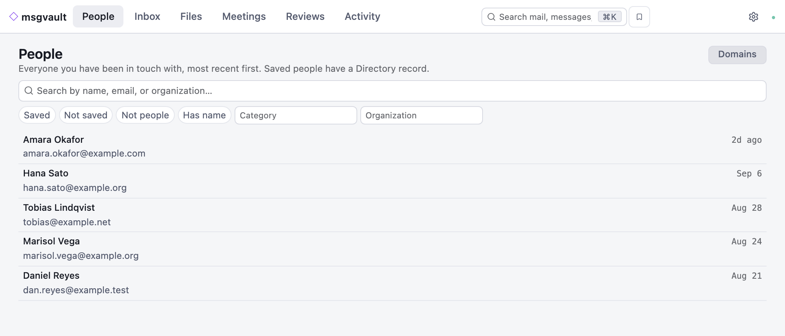
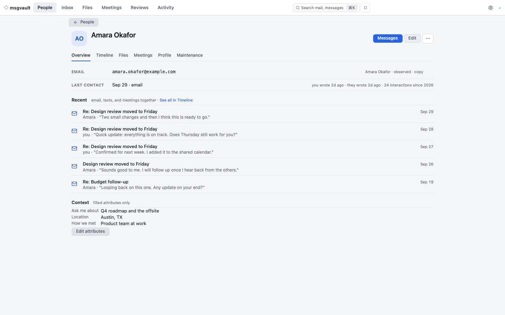

<p align="center">
  
</p>

<h1 align="center">msgvault</h1>

<p align="center">
  A fork of <a href="https://github.com/kenn-io/msgvault">kenn-io/msgvault</a>, with gratitude.
</p>

<p align="center">
  <a href="https://go.dev"></a>
  <a href="LICENSE"></a>
  <a href="https://github.com/kenn-io/msgvault"></a>
  <a href="https://github.com/metcalfc/msgvault/issues"></a>
</p>

<p align="center">
  <a href="docs/index.md">Documentation</a> ·
  <a href="docs/setup.md">Setup Guide</a> ·
  <a href="docs/usage/tui.md">Interactive TUI</a>
</p>

## Built on msgvault

This project is a fork of [kenn-io/msgvault](https://github.com/kenn-io/msgvault).
Nearly everything here started there: the archive, importers, daemon, CLI,
TUI, and documentation. Thank you to the msgvault maintainers and contributors
for building it in the open and sharing it under the MIT license.

The fork has diverged substantially. We intend to keep contributing changes
back upstream where they fit. If you want the upstream experience, including
Windows support, a provider-neutral model setup, and the upstream Web UI, use
[upstream msgvault](https://github.com/kenn-io/msgvault) and its
[documentation](https://msgvault.io/docs/).

### How this fork differs

- **A different Web UI.**
- **Jev only where a judgment is needed.** Jev, TypeSafe's judgment model,
  answers narrow questions such as whether two differently written names are
  one person; exact checks belong in code. Every Jev feature is opt-in and
  consent-gated. See [Jev judgments](docs/usage/jev-judgments.md).
- **macOS and Linux only.** Native Windows support has been removed.
- **A narrower set of model providers.** The fork focuses on local
  models through Ollama for embeddings and people inference, Exa for public
  profile enrichment, and Jev for narrow judgments, rather than a
  provider-neutral matrix. Other providers remain in the code but are not a
  focus. See [recommended configuration](docs/usage/recommended-configuration.md).

### Where to report issues

Report problems with this fork at
[metcalfc/msgvault issues](https://github.com/metcalfc/msgvault/issues). Report
a problem to [kenn-io/msgvault issues](https://github.com/kenn-io/msgvault/issues)
only when it also reproduces with an upstream release or upstream `main`.

<p align="center">
  
  <br>
  <em>People: everyone you have been in touch with, most recent first (synthetic data).</em>
</p>

<p align="center">
  
  <br>
  <em>A person profile: last contact, recent threads, and the context you saved (synthetic data).</em>
</p>

**Keep your communications and relationships in an archive you own.**

msgvault is a local-first, open-source archive for email, chat, meetings,
calendars, and contacts. Keep your history on your own hardware, find messages
and files, and connect the addresses and handles that belong to the same person.
Use the browser, terminal, CLI, HTTP API, or an AI assistant through MCP.

> **Alpha software.** APIs, storage format, and CLI flags may change. Back up
> your data. This README follows current `main`; see the
> [0.20.0 changelog](docs/changelog.md#0200) for features and upgrade steps.

## What you can do

- **Bring your history together.** Sync mail, chat, calendars, meeting notes,
  and contacts, or import local exports. See the [source guide](docs/guides/sources.md).
- **Find the message or file you need.** Search by sender, date, mailing list,
  or words. Optionally enable search by meaning, document text extraction,
  and image search with a provider you choose.
- **Keep track of people.** Connect identities, curate profiles and relationships,
  browse contact activity, and sync contacts with CardDAV. Optional profile
  automation and conversation briefs require separate consent.
- **Explore the archive.** Group messages by people, domains, time, source, and
  type in the [Web UI](docs/web-ui.md) or [TUI](docs/usage/tui.md). Save useful
  views and monitor background work.
- **Use your own tools.** Query with SQL, export messages and attachments, or
  connect an agent to the [MCP server](docs/usage/chat.md).
- **Preserve and maintain it.** Deduplicate copies, back up the archive, and
  review staged mail deletions before explicitly removing messages upstream.
  Remote deletion preserves archived messages and attachments.

Keyword search and analytics read your archive without contacting its source
services. Sync needs access to those services. Optional model and enrichment
features send selected data to the endpoints you configure; local embedding
servers are also supported. See [recommended configuration](docs/usage/recommended-configuration.md)
for the choices and consent steps.

## Installation

This fork has no release binaries; build it from source on macOS or Linux.
You need **Go 1.27+**, **Bun 1.3.14+**, **Node.js 20.19+ on 20.x, 22.13+ on
22.x, or 24+**, and a C/C++ compiler for CGO and to statically link DuckDB. On
Debian/Ubuntu also install `libsqlite3-dev` for the `sqlite3.h` header used by
the default `sqlite_vec` build.

```bash
git clone https://github.com/metcalfc/msgvault.git
cd msgvault
make install
```

See the [setup guide](docs/setup.md) for details.

**Upstream msgvault:** the `msgvault.io` install script, Homebrew, and
conda-forge packages install upstream releases, not this fork. See the
[upstream setup guide](https://msgvault.io/docs/setup/) if you want those.

## Quick Start

For Gmail, first create an OAuth credential with the
[OAuth setup guide](docs/guides/oauth-setup.md). Then archive a small first batch:

```bash
msgvault init-db
msgvault add-account you@gmail.com
msgvault sync-full you@gmail.com --limit 100
msgvault serve
```

Open the `API server` URL printed by `msgvault serve`. The binary includes the
browser application; it needs no separate Node or Bun installation
at runtime. Use `msgvault tui` for the terminal interface.

For another provider or a local export, start with
[choosing a source](docs/guides/sources.md). Google credentials are needed only
for Google-backed sources. The [setup guide](docs/setup.md) covers installation,
first sync, and running on your own server.

## Find your next step

| I want to… | Read |
|---|---|
| Understand the product | [Introduction](docs/introduction.md), or upstream's [product overview](https://msgvault.io/) and [archive lifecycle](https://msgvault.io/guide/) |
| Catch up after 0.19 | [Changelog and upgrade notes](docs/changelog.md#0200) |
| Search messages and attachments | [Searching](docs/usage/searching.md) and [document indexing](docs/usage/document-indexing.md) |
| Maintain contacts and relationships | [People and profiles](docs/usage/people.md) |
| Import local text-message history | [Text message imports](docs/usage/text-messages.md) |
| Configure optional AI features | [Recommended configuration](docs/usage/recommended-configuration.md) |
| Run msgvault on a server | [Remote deployment](docs/guides/remote-deployment.md) |
| Back up or free mailbox space | [Backup](docs/usage/backup.md) and [deleting email](docs/usage/deletion.md) |
| Look up a command or setting | [CLI reference](docs/cli-reference.md) and [configuration](docs/configuration.md) |
| Build or contribute | [Development](docs/development.md) and [agent guide](AGENTS.md) |

## Community

[Report an issue with this fork](https://github.com/metcalfc/msgvault/issues).
For upstream msgvault, join the [msgvault Discord](https://discord.gg/fDnmxB8Wkq),
[report an upstream issue](https://github.com/kenn-io/msgvault/issues), or read
the [upstream documentation](https://msgvault.io/docs/).

## License

[MIT](LICENSE). Copyright (c) 2025-2026 Wes McKinney, as stated in the
[LICENSE](LICENSE) file. This fork is distributed under the same license.
